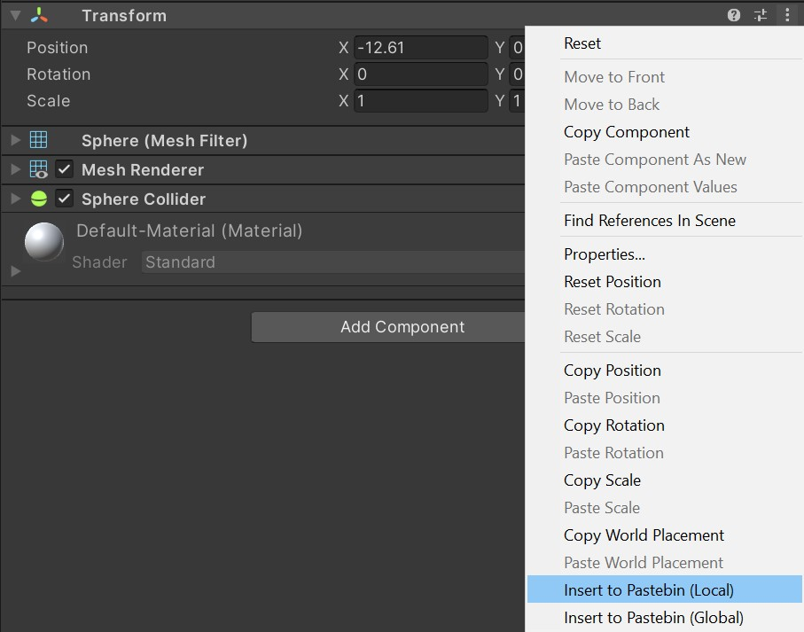
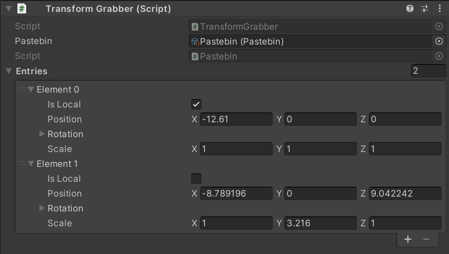

# TransformPastebin
Transform Pastebin is a tool that lets you quickly save transform values you create at runtime.

While working on a scene, it is sometimes easier to just run the game, see how the scene plays out, and maybe make adjustments to the camera or the objects.

It's all fun and games until you need to copy more than one transform.

The Transform Pastebin tool adds two options to Transform component's context menu, like this:

Then, when you select either of the options, it forwards the Transform to the Transform Grabber component in the scene, which in turn saves the values in a list, like this:

Since the pastebin is a scriptable object in the asset menu, even after the runtime is over, the values live on, and you can just paste them back to where they came from. (Or anywhere else, for that matter.)

This version is the minimum working version. Next iteration will include custom drawer view for Pastebin entries that can write the saved values back on Transform objects.